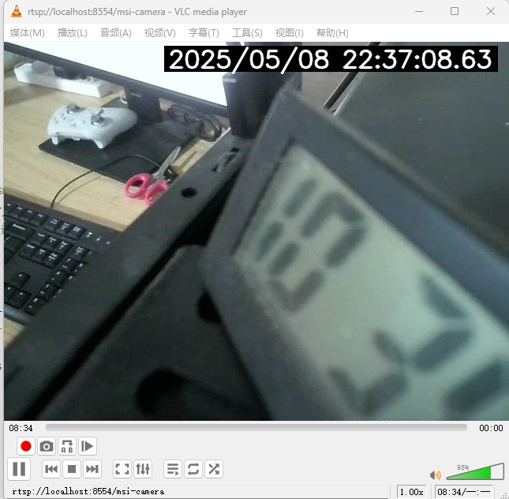

# Linux/Fedora/thinkpad-x250
```shell
ffmpeg -f v4l2 -video_size 1280x720 -framerate 30 -i /dev/video0 \
-vf "drawtext=text='%{localtime\:%T}': x=w-tw-10: y=10: fontsize=20: fontcolor=red" \
-c:v mpeg4 -q:v 1 \
-f rtsp rtsp://localhost:8554/x250-camera
```

# Windows OS with Python
启动mediamtx  
执行code/main.py程序  

